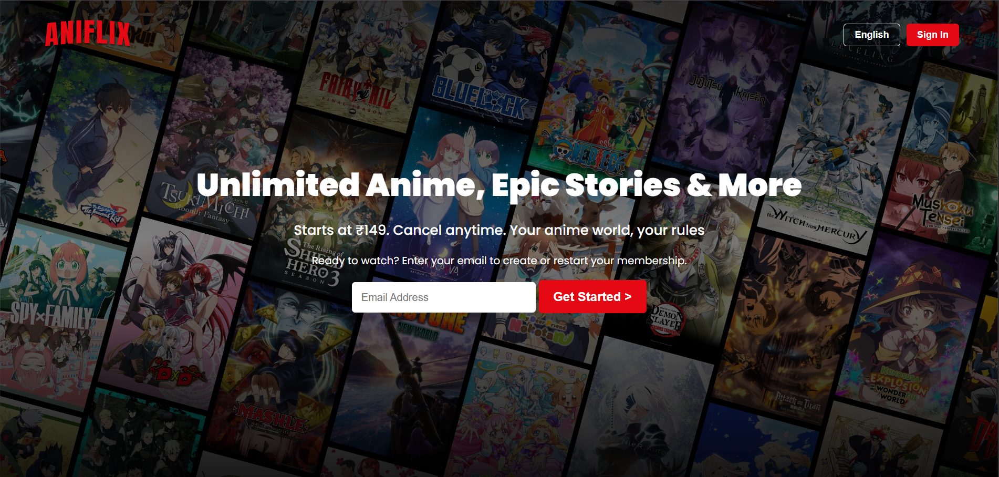
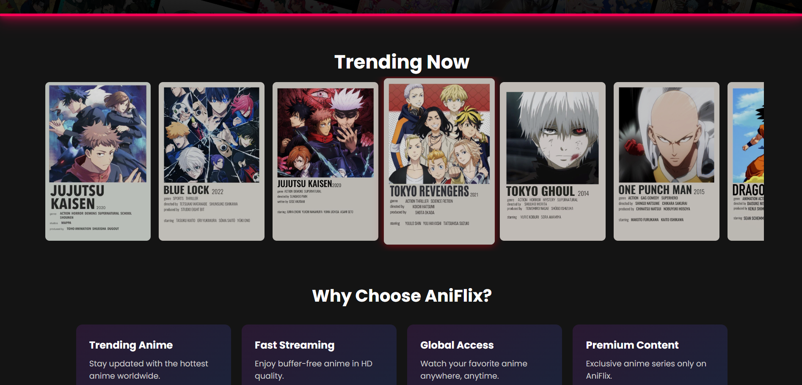
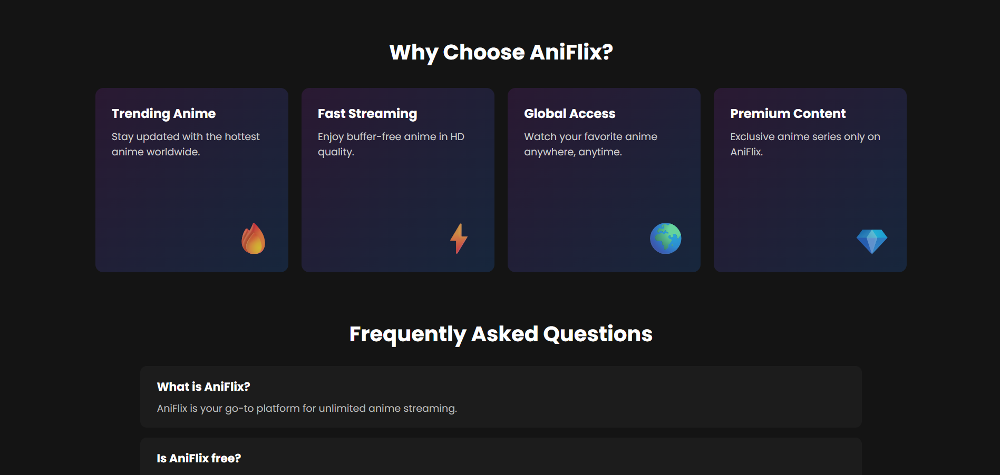
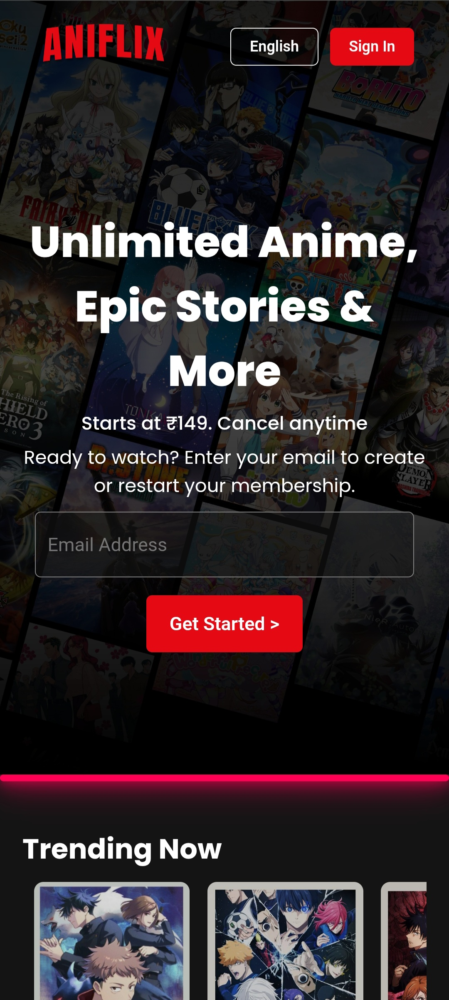
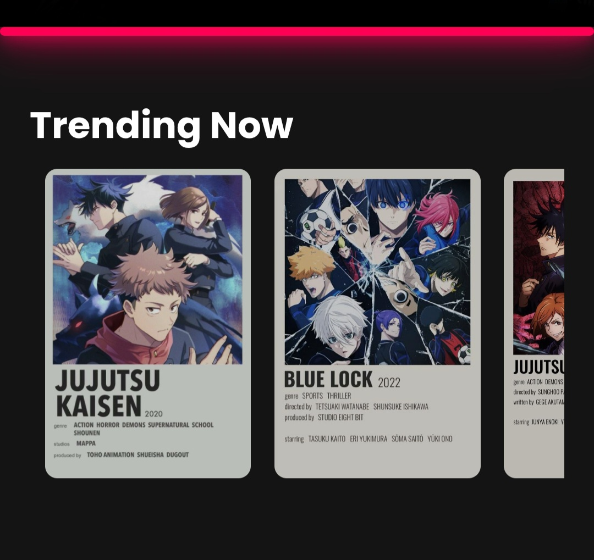
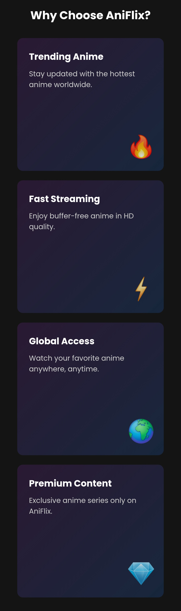
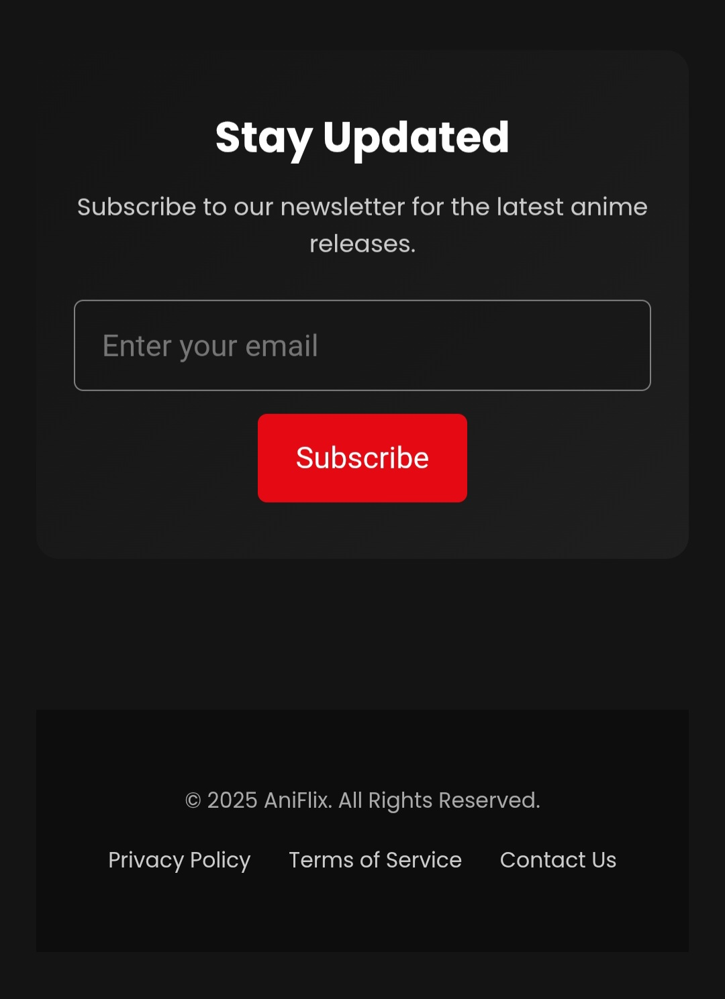

# 🎬 AniFlix  

AniFlix is a **Netflix-inspired landing page clone** built using **pure HTML and CSS**.  
It replicates the look and feel of Netflix’s homepage, featuring a sleek UI, responsive layout, and modern design elements — all without a single line of JavaScript.  

---

## 🚀 Features  

- 🖥️ **Navbar** with logo, language option & sign-in button  
- 🎥 **Hero Section** with headline, subline & CTA button  
- 🎞️ **Anime/Movie Cards** arranged in rows (Trending, Popular, etc.)  
- 💡 **Why Choose AniFlix Section** highlighting key features  
- ❓ **FAQ Section** with collapsible-style layout (static in CSS)  
- 📜 **Footer** with multiple link groups  
- 📱 **Responsive Design** – works across devices  

---

## 🛠️ Tech Stack  

- **HTML5** – Structure & content  
- **CSS3** – Styling, Flexbox/Grid, Animations, Responsive layout

---
## 📸 Screenshots  
### 🖥️ Desktop Preview  

  
  
  
  

### 📱 Mobile Preview  

  
  
  
  
  

  

---

## 💡Inspiration

This project was inspired by Netflix’s official landing page UI and created as a mini-project for learning frontend development.

### 👤
**Mohammad Zaib**

